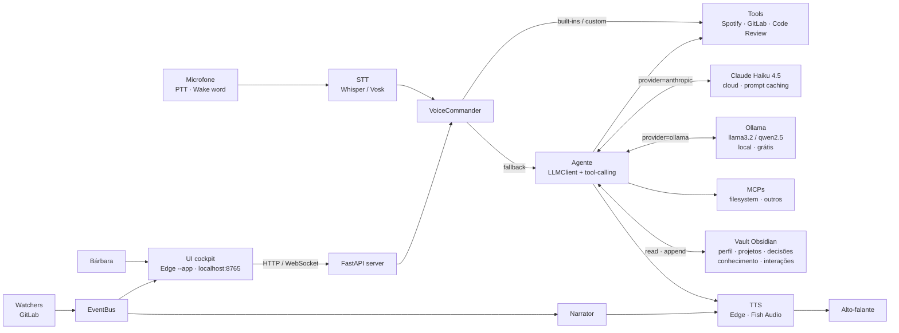

<div align="center">
  

  <h3>Assistente pessoal local com cérebro em Obsidian</h3>
  <p>Voz, push-to-talk, watchers, ferramentas plugáveis e memória persistente em Markdown.<br/>Inspirado no J.A.R.V.I.S. de Tony Stark — só que rodando em <code>localhost</code> e atendendo a Senhora Bárbara.</p>

  <br/>

  
  
  
  
  
  
  
</div>

## Contexto

O **Jarvis** é um assistente pessoal que roda 100% localmente: a UI sobe num servidor FastAPI, o **cérebro** é um vault Obsidian no disco, e o **motor de raciocínio** é trocável — Claude (cloud) ou Ollama (local). Ele atende por voz (push-to-talk + wake word) e por texto, monitora eventos (GitLab), anuncia em voz alta e dispara skills (Spotify, code review, MCPs).

**Princípio central:** o cérebro é o **Obsidian** — tudo que o Jarvis "sabe" persiste em arquivos `.md` no seu disco. O motor LLM lê o cérebro, raciocina e responde, mas não é o cérebro. Você troca o motor sem perder memória.

**Persona:** Jarvis fala em primeira pessoa, nunca cita "Claude", "Anthropic", "Ollama" ou qualquer ferramenta interna.

## Funcionalidades

| Funcionalidade | Onde | Descrição |
|---|---|---|
| Cockpit Home | view `Home` | Painel `[ • SYSTEMS ]` com data/hora e dots de status, `[ • VAULT OVERVIEW ]` com pills (notas, links, hoje, 7d) e o reator central com push-to-talk + composer |
| Mega-Brain | view `Mega-Brain` | Cérebro consolidado: métricas (notas, wikilinks, ingestões hoje/7d, MCPs conectados, interações), grafo 2D do Obsidian Brain, **última coisa aprendida**, agentes (MCPs) e comandos de voz |
| Ingerir conhecimento | botão `✦ Ingerir conhecimento` | Modal estilo MEGA-BRAIN com tabs **Texto** / **Arquivo** + dropdown de categoria (`conhecimento` / `perfil` / `projetos` / `decisões`). Salva em `vault/<categoria>/YYYY-MM-DD-slug.md` com frontmatter, indexado pelo Obsidian |
| Sintetizar memórias | botão `✦ Sintetizar memórias` | LLM lê interações recentes e propõe atualizações curtas em `perfil/`/`projetos/`/`decisoes/`. Cada proposta é aprovada/rejeitada à mão |
| Push-to-talk | hotkey `Ctrl+Alt+J` | Aperta, fala, solta. STT transcreve, dispatcher roda built-ins ou cai no agente. Spotify ducka durante a fala |
| Wake word | opt-in no config | Escuta contínua por "Jarvis" via Vosk. Pausa automática enquanto o assistente fala |
| Watchers | módulos plugáveis | GitLab `/api/v4/todos`: anuncia review requests, mentions, MRs em conflito. Estado persistido pra não duplicar |
| Configurações em abas | view `Configurações` | Sub-abas **Geral** / **Credenciais** / **Voz** / **Motor** / **Tools** — sem scroll de página |
| Credenciais (`.env` via UI) | aba `Credenciais` | Painel localhost-only: status visível, valor mascarado por bullets, botão "Trocar" revela o valor real só quando você está editando. Catálogo cobre Anthropic, GitLab, Spotify |
| Briefing matinal | automático | Quando passa de 6h desde o último, Jarvis abre falando o que importa hoje (GitLab + estado do vault) |

## Arquitetura



**Fluxo de um turno por voz:**
1. PTT (Ctrl+Alt+J) ou wake word ativa o microfone.
2. Whisper transcreve o áudio em PT-BR.
3. `VoiceCommander` tenta dispatch local: built-ins (`pausa`, `próxima`...) ou comandos custom.
4. Sem match, cai no agente, que usa o `LLMClient` configurado (Anthropic ou Ollama).
5. O motor decide tools, executa o loop `tool_use` até `end_turn`, e devolve o texto.
6. `Narrator` fala via TTS; vault registra o turno em `interacoes/YYYY-MM-DD.md`.

## Tecnologias

| Categoria | Tecnologia |
|---|---|
| Runtime | Python 3.14+ |
| API/UI server | [FastAPI](https://fastapi.tiangolo.com) + [Uvicorn](https://www.uvicorn.org) + WebSocket |
| Frontend | HTML/CSS/JS vanilla — SPA cockpit sem framework, grafo SVG force-directed à mão |
| Motor (cloud) | [Claude Haiku 4.5](https://anthropic.com) via [Anthropic SDK](https://github.com/anthropics/anthropic-sdk-python) com tool-calling e prompt caching |
| Motor (local) | [Ollama](https://ollama.com) com Llama 3.2 / Qwen 2.5 via API OpenAI-compatible |
| Memória | Vault de markdown local (formato Obsidian) |
| Tool-calling externo | [MCP](https://modelcontextprotocol.io) — múltiplos servidores configuráveis pela UI |
| TTS | [Edge TTS](https://github.com/rany2/edge-tts) (grátis) ou [fish.audio](https://fish.audio) (voz clonada) |
| STT | [faster-whisper](https://github.com/SYSTRAN/faster-whisper) ou [Vosk](https://alphacephei.com/vosk) |
| Hotkey global | [pynput](https://pynput.readthedocs.io) |
| Tools nativas | [spotipy](https://spotipy.readthedocs.io), GitLab REST, code review |

## Pré-requisitos

- **Python 3.14** ou superior — [python.org](https://python.org)
- **Edge** instalado (a UI abre como app)
- **Motor LLM** (escolhe um):
  - **Anthropic** (default) — chave de API em [console.anthropic.com](https://console.anthropic.com). Haiku 4.5 ≈ ~2000 turnos por US$5 com prompt caching ativo
  - **Ollama** (local) — [ollama.com](https://ollama.com) + um modelo: `ollama pull llama3.2:3b` (rápido, ~2GB) ou `ollama pull qwen2.5:7b` (melhor PT-BR e tool calling, ~5GB)
- *(Opcional)* Conta **Spotify Developer** — [developer.spotify.com](https://developer.spotify.com/dashboard)
- *(Opcional)* **Personal Access Token do GitLab** com escopos `read_api`, `read_user`
- *(Opcional)* **fish.audio** com voz clonada — apenas se quiser TTS pago em vez do Edge

## Configuração de credenciais

Você tem **dois caminhos** pra configurar as secrets:

**A) UI (recomendado)** — aba **Configurações → Credenciais**:
- Painel mostra cada secret com status (✓ definida / ausente / obrigatória vazia)
- Quando definida: bullets cosméticos (`••••••••`) + botão **Trocar** que revela o valor real só durante edição
- Endpoint só atende em `127.0.0.1` — credenciais nunca trafegam na rede
- Salvo no `.env` local com escrita atômica

**B) Editar `.env` à mão**, baseado no `.env.example`:

```env
# Motor — necessária se provider=anthropic
ANTHROPIC_API_KEY=sk-ant-...

# TTS pago opcional (se engine = fish_audio)
FISH_AUDIO_API_KEY=
FISH_AUDIO_VOICE_ID=

# GitLab watcher e tool (opcional)
GITLAB_TOKEN=
GITLAB_URL=https://gitlab.com

# Spotify tool (opcional)
SPOTIFY_CLIENT_ID=
SPOTIFY_CLIENT_SECRET=
SPOTIFY_REDIRECT_URI=http://127.0.0.1:8888/callback
```

> O `.env` está no `.gitignore` — nunca comite credenciais.

Sem cada chave opcional, a capacidade correspondente é desativada graciosamente. Sem `ANTHROPIC_API_KEY` *e* sem Ollama rodando, o agente fica off — mas dispatch local + TTS + watchers continuam funcionando.

## Como Executar Localmente

**1. Instalar dependências**

```powershell
py -m pip install -r requirements.txt
```

**2. (Opcional) Subir o Ollama** se quiser rodar offline:

```powershell
ollama pull llama3.2:3b   # ou qwen2.5:7b para qualidade superior
ollama serve              # já roda como service no Windows depois da instalação
```

**3. (Opcional) Baixar modelo de STT**

```powershell
py scripts/setup_stt.py    # baixa modelo Vosk para wake-word
```

Whisper baixa o modelo automaticamente no primeiro uso.

**4. (Opcional) Autorizar Spotify**

```powershell
py scripts/setup_spotify.py
```

Abre o navegador, autoriza no Spotify, salva token em `.jarvis_state/spotify_cache`.

**5. Subir o Jarvis**

```powershell
py main.py
```

A UI abre automaticamente em [http://127.0.0.1:8765](http://127.0.0.1:8765) (Edge `--app` em janela própria). Ele anuncia "Bom dia/tarde/noite, Senhora" e fica esperando comando.

**6. Configurar credenciais pela UI** (se ainda não fez via `.env`)

Configurações → Credenciais → cole sua `ANTHROPIC_API_KEY` (ou outras) → Salvar → reinicia o Jarvis pra aplicar nos componentes.

## Trocar entre motor cloud e local

Em **Configurações → Motor**:
- `provider: anthropic` + `model: claude-haiku-4-5-20251001` → cloud (qualidade alta, tool calling robusto)
- `provider: ollama` + `model: llama3.2:3b` ou `qwen2.5:7b` → local (zero custo, privado, ideal pra dados sensíveis)

`base_url` só é lido se `provider=ollama` (default `http://localhost:11434/v1`). Após salvar, reinicie o Jarvis pra que o `LLMClient` recarregue.

## Estrutura

```
jarvis/
├── core/
│   ├── llm_client.py       # Abstração unificada Ollama + Anthropic, prompt caching automático
│   ├── agent.py            # Loop tool-calling agnóstico de provider, fallback gracioso
│   ├── persona.py          # Personalidade PT-BR, system prompt, anúncios GitLab
│   ├── narrator.py         # Reprodução TTS + ducking integrado
│   ├── tts.py              # Engines plugáveis (edge_tts, fish_audio)
│   ├── stt.py              # Vosk
│   ├── stt_whisper.py      # faster-whisper
│   ├── vault.py            # Cérebro markdown — perfil/projetos/decisões/conhecimento/interações
│   ├── synthesizer.py      # Promove fatos das interações pra arquivos curados
│   ├── briefing.py         # Briefing matinal automatizado
│   ├── voice_command.py    # Dispatch local (built-ins + custom + fuzzy)
│   ├── mcp_manager.py      # Conecta múltiplos servidores MCP, hot reload
│   ├── command_registry.py # Catálogo Tool/Action expor à UI
│   ├── event_bus.py        # Pub/sub interno para UI/narrator/ducker
│   ├── hotkey.py           # Push-to-talk global
│   ├── wake_word.py        # Escuta contínua por "Jarvis"
│   ├── spotify_ducker.py   # Reduz volume do Spotify enquanto Jarvis fala
│   ├── config_manager.py   # Leitura/patch atômico de config/jarvis.yaml
│   └── secrets_manager.py  # Catálogo + leitura/escrita atômica do .env (localhost-only via API)
├── tools/
│   ├── spotify.py          # Pause, resume, next, previous, play_playlist, current
│   ├── gitlab.py           # MR, issue, pipeline, todos
│   └── code_review.py      # Skill do Claude Code disparada por voz
├── watchers/
│   ├── base.py             # Interface Watcher
│   └── gitlab.py           # Polla todos pendentes e anuncia
├── server/
│   ├── app.py              # FastAPI: rotas REST + WebSocket /ws
│   └── ui/
│       ├── index.html      # SPA cockpit — Home / Mega-Brain / Histórico / Configurações
│       └── static/         # style.css, app.js, favicon.svg, manifest
├── scripts/
│   ├── setup_stt.py        # Baixa modelo Vosk
│   ├── setup_spotify.py    # OAuth Spotify
│   ├── check_gitlab.py     # Smoke test do token GitLab
│   ├── test_voice.py       # Smoke test TTS
│   ├── test_announce.py    # Roda 1 poll com state fresco
│   └── test_review_flow.py # Skill code review end-to-end
├── config/
│   ├── jarvis.yaml         # User, narrator, watchers, hotkey, comandos custom, vault, agent (provider/model/base_url)
│   └── mcp_servers.json    # Lista de MCPs configurados (gerado pela UI)
├── main.py                 # Entry point: boot + loop + watchers + hotkey
├── requirements.txt
└── .env.example
```

## Vault como cérebro

O Jarvis usa um vault de markdown como memória persistente. Tudo é arquivo `.md`, lido também pelo Obsidian:

```
~/Documents/jarvis-vault/
├── INDEX.md            # curado, sempre lido
├── perfil/             # curado, injetado no system prompt
├── projetos/           # curado, injetado no system prompt
├── decisoes/           # curado, referência (não injetado por padrão)
├── conhecimento/       # ingerido pela UI — referência, não vai pro contexto
└── interacoes/         # YYYY-MM-DD.md — append-only, escrito pelo Jarvis
```

`perfil/` e `projetos/` entram no system prompt do agente a cada turno — fatos sobre você e seus projetos viram parte do "cérebro ativo" do Jarvis. `decisoes/` e `conhecimento/` ficam como referência indexada (não poluem o contexto). `interacoes/` é registro append-only que o `Synthesizer` lê para propor patches curados.

**Abrir no Obsidian:** Open folder as vault → aponte para `~/Documents/jarvis-vault`. O graph view nativo mostra wikilinks `[[X]]` entre notas. O painel `[ • OBSIDIAN BRAIN ]` da Mega-Brain replica isso em 2D.

## Scripts

| Script | Descrição |
|---|---|
| `py main.py` | Sobe o Jarvis (UI, watchers, hotkey) |
| `py scripts/setup_stt.py` | Baixa o modelo Vosk |
| `py scripts/setup_spotify.py` | Autoriza Spotify (OAuth) |
| `py scripts/check_gitlab.py` | Smoke test do token GitLab |
| `py scripts/test_voice.py` | Smoke test TTS (fala uma frase) |
| `py scripts/test_announce.py` | Roda 1 poll com state fresco — força anúncio de evento |
| `py scripts/test_review_flow.py` | Smoke test do code review |

## Licença

Repositório pessoal — uso restrito.
